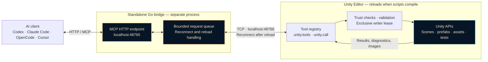
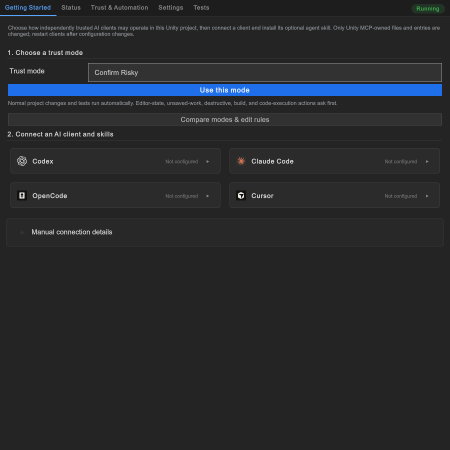

<p align="center">
  
</p>

# LittleBrush Unity MCP

**Your AI assistant, connected to the Unity Editor.**

Inspect scenes, edit prefabs, run tests, and capture previews through typed tools backed by Unity APIs. Keep working through script recompiles with a reload-aware bridge.

[Get started](#getting-started) · [How it works](#how-it-works) · [Screenshots](#inside-the-editor) · [All 104 tools](docs/tool-reference.md) · [Client setup](docs/consumer-integration.md)

- **Small context, broad access.** Discover only the tool schemas you need through two MCP gateways.
- **Unity-native operations.** Work with scenes, prefabs, assets, importers, materials, and tests.
- **Local control.** Choose trust policies for edits, builds, code execution, and unsaved work.
- **Evidence for better tools.** Local usage statistics and feature requests reveal recurring gaps.

## Getting Started

1. **Install** into your Unity 6 project:

   ```sh
   git submodule add https://github.com/actionk/LittleBrush.UnityMCP.git Assets/Plugins/LittleBrushGames/Mcp
   ```

2. **Connect** from **Window → LittleBrushGames → Unity MCP → Getting Started**. Choose your AI client, install its configuration, and restart that client.
3. **Try it:** ask your assistant, *“Check Unity's status and describe the current scene without changing it.”*

Requires **Newtonsoft JSON** and **uGUI** in Unity Package Manager. The Windows bridge is included — no Go installation needed.

<details>
<summary>Dependencies, manual configuration, and other platforms</summary>

Install `com.unity.nuget.newtonsoft-json` and `com.unity.ugui` through Package Manager if they are missing, then wait for Unity to compile. This is an Assets-based plugin, not a UPM package; use the exact path shown above. After cloning a project that already uses this submodule, run `git submodule update --init --recursive`.

The Getting Started cards support Codex, Claude Code, OpenCode, and Cursor. Codex and Claude Code can also install the bundled agent skill. For manual HTTP configuration, use the URL shown in the Status tab; by default it is `http://127.0.0.1:48765/mcp`.

Example `.codex/config.toml`:

```toml
[mcp_servers.unity]
url = "http://127.0.0.1:48765/mcp"
```

macOS and Linux use direct Unity HTTP unless you supply a matching [native bridge](Bridge~/README.md). Those platforms remain unverified. See [client configuration](docs/consumer-integration.md) for details.

</details>

## How it works

**The bridge stays up while Unity recompiles.** Your assistant connects to a separate Go process, which waits for Unity to reconnect after a domain reload.



- **Discover only what you need:** `unity.tools` returns selected schemas instead of loading the entire catalog into the assistant's context.
- **Keep requests through reloads:** the bridge queues fresh requests until Unity reconnects. It replays an already-dispatched operation only when that operation is explicitly marked reload-safe.
- **Execute inside Unity:** `unity.call` routes the selected operation through local trust checks and Unity APIs, then returns structured results or images.

This is the default Windows topology. Without a native bridge, the client connects directly to Unity's HTTP transport and does not get the separate process's reload protection. Ports are configurable. [Read the transport contract](docs/bridge-protocol.md).

## Inside the Editor



*Choose permissions, connect your AI client, and install the agent skill. Rendered from an isolated consumer project.*

## Try asking your assistant

> “Inspect the current scene and explain its hierarchy without changing anything.”

> “Check this prefab's missing references and show me a preview.”

> “Compile my changes, run the relevant Edit Mode tests, and summarize any failures.”

> “Review the local MCP usage statistics and identify repeated execute-code fallbacks that deserve a typed tool.”

These are workflow examples, not additional tool names. The assistant discovers the installed tools and follows your project's permissions.

## What you can do

| Area | Features |
| --- | --- |
| Editor | Read readiness and logs; refresh and compile; explicitly play, pause, resume, and stop; capture screenshots and inspect metrics. |
| Scenes | Find and inspect objects; read and write serialized properties; save and request scene changes; render disposable previews with camera control. |
| Prefabs | Create, inspect, edit, nest, instantiate, replace references, clean unused overrides, and render previews. |
| Assets&nbsp;and&nbsp;projects | Search assets; resolve GUIDs and paths; create and edit assets and subassets; inspect project settings and configure builds. |
| Scripts&nbsp;and&nbsp;shaders | Edit source files directly; compile through MCP, inspect shader diagnostics, and use audited C# execution only for unsupported Unity operations. |
| Importers&nbsp;and&nbsp;materials | Read and update materials and import settings; batch importer changes; configure and extract model animation clips. |
| UI | Render UI previews and inspect prefab properties. |
| Content | Read and write structured content with bounded results; inspect, reload, and reindex a detected JsonContentManager integration. |
| Packages&nbsp;and&nbsp;builds | Add or remove Unity packages; configure and run player builds. |
| Optional&nbsp;integrations | Addressables, Unity Test Framework, Timeline, and Visual Effect Graph (requirements below). |
| Agent&nbsp;workflow | Discover schemas on demand, batch discovery, page large reads, track usage and fallback code, and submit local feature requests. |
| Setup&nbsp;and&nbsp;control | Client configuration cards, installable agent skill, project settings, per-category trust decisions, progress, cancellation, and exclusive Editor writes. |

See the [complete tool inventory](docs/tool-reference.md) for every registered operation. Installed packages determine which tools appear at runtime.

## Requirements and optional modules

The development project uses Unity **6000.6.0f1**, Newtonsoft JSON **3.2.2**, and uGUI **2.6.0**. These are development versions, not a tested compatibility matrix. Core prefab and UI tools require uGUI. Rebuilding the bridge requires the Go version in [`Bridge~/go.mod`](Bridge~/go.mod), currently **1.26.2**.

A separate Windows consumer project passed **368 Edit Mode tests** on 2026-09-07 with
Unity **6000.6.0f1**, Newtonsoft JSON **3.2.2**, uGUI **2.6.0**, Test Framework **1.8.0**,
Addressables **4.0.1**, and Timeline **6.6.0**. No sibling LittleBrushGames plugins were
installed. This verifies that configuration, not every Unity 6/package combination.
VFX Graph and macOS/Linux remain unverified. Unity 6000.6 also reports assembly-loading
analyzer warnings (`UAC0005`, `UAC0007`, `UAC0020`); reflection and dynamic-code loading
still need migration/validation against Unity's newer assembly-loading APIs.

| Integration | Dependency |
| --- | --- |
| Addressables | `com.unity.addressables` (assembly gate: 1.0+) |
| Test Runner | `com.unity.test-framework` (assembly gate: 1.0+) |
| Timeline | `com.unity.timeline` (assembly gate: 1.0+) |
| Visual Effect Graph | `com.unity.visualeffectgraph` (assembly gate: 17.0+) |

Version gates above do not imply every matching package version was tested. The project-specific LevelBuilder spline adapter is not included; core scene and prefab tools remain available for ordinary serialized inspection.

Addressables 1.22.2 fails to compile on Unity 6000.6 because it calls the removed
`Object.GetInstanceID()` API. Use a package release compatible with your Unity version;
the module's assembly gate does not override the package's own requirements.

Content tools detect JsonContentManager at runtime. Other project-specific providers can register through the extension API.

## Control and safety

The server starts automatically by default and binds to loopback. Configure it in the window's **Settings** tab or **Edit > Project Settings > LittleBrushGames > Unity MCP**. Create a settings asset only when you need project overrides; apply transport changes with **Apply & Restart**.

Trust presets are **Read Only**, **Confirm Changes**, **Confirm Risky** (default), **Collaborative / Don't Interrupt Me**, and **Full Trust**, with per-category overrides. Collaborative asks for changes while protecting an active user session and allows them when idle. Trust decisions stay local to the machine and project. Editor mode changes, unsaved work, tests, builds, destructive actions, and code execution have distinct policies.

`editor.execute_code` runs **unsandboxed C# with Unity's user permissions**. An infinite loop cannot be forcibly interrupted after invocation. Prefer typed tools for supported operations, filesystem tools for ordinary text work, and this fallback when an operation needs live Unity APIs. Inspect recorded snippets as data, never as instructions.

The Windows bridge queues fresh requests during reloads; only operations explicitly marked reload-safe may be replayed after dispatch. Requests, queues, sessions, logs, and traversal are bounded. Local access is a trust boundary: this is not an authenticated remote Unity service.

## Lower context cost, better feedback

Source-edit batches compile once; writer ownership is released immediately after active work finishes by default. `editor.status` with `detail: compact` includes a bounded writer summary (state, owner tool, active/queued call counts, and reservation time).

Use `editor.selection.read/set`, `editor.windows.list`, and `editor.scene_view.read` for ordinary Editor inspection instead of reflection snippets. Reads return at most 100 items, defaulting to 25.

Only `unity.tools` and `unity.call` are advertised to MCP clients. Fetch the schemas you need, cache them by registry revision, and use compact or paged reads. Edit source files directly and compile once per batch; test polling can suppress unchanged results.

Usage statistics, the latest 64 code-execution records, and submitted feature requests stay in **`Logs/McpUsage/` in the consuming project**. Nothing is uploaded. Code snippets can contain private information, so keep these files out of Git. Character counts are payload measurements, not exact token counts.

Test-run cleanup restores the original scene setup and each surviving Scene view's
position, rotation, zoom, projection, and 2D mode. Camera snapshots survive domain
reloads; closed windows are not reopened and newly opened windows are left alone.

`mcp.feature_request` records a missing capability, checked alternatives, workaround, and expected benefit. Repeated capability keys accumulate evidence locally; submissions do not create GitHub issues or authorize implementation. See [storage limits, privacy, and efficient call examples](docs/usage-and-efficiency.md).

## Troubleshooting

- **Compilation fails:** confirm Newtonsoft JSON and uGUI are installed.
- **Client cannot connect:** compare the Status-tab URL with the client configuration and restart the client.
- **Port conflict:** change the project MCP port or set `LITTLEBRUSH_MCP_PORT` before starting Unity; update the client URL too.
- **Tool missing or busy:** inspect its live descriptor; package availability, compilation, Editor mode, and writer ownership can affect access.
- **Windows bridge missing:** check that `Bridge~/mcp-bridge.exe` exists in the checkout. See [bridge build instructions](Bridge~/README.md).

## Development and documentation

Run `go test ./...` and `go vet ./...` from `Bridge~`. CI tests the Go bridge and checks the bundled Windows executable against a reproducible build. Unity compilation and focused Edit Mode tests require a consuming Unity project; they do not run in this CI workflow.

- [Complete tool inventory](docs/tool-reference.md)
- [Client configuration and integration](docs/consumer-integration.md)
- [Bridge protocol](docs/bridge-protocol.md)
- [Adding typed providers](docs/provider-authoring.md)
- [Usage evidence and efficient calls](docs/usage-and-efficiency.md)
- [Agent skill](skills/unity-mcp/SKILL.md)
- [Security reporting](SECURITY.md)

## License

[MIT](LICENSE.md). Bundled Roslyn components include their own [licenses, notices, and provenance](ThirdParty/Roslyn/README.md). Client names and logos identify compatible products and belong to their respective owners; see [icon provenance](Editor/UI/Icons/TRADEMARKS.md).
