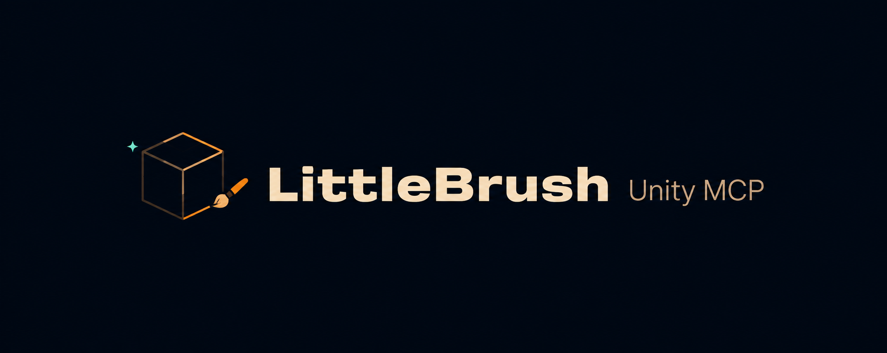
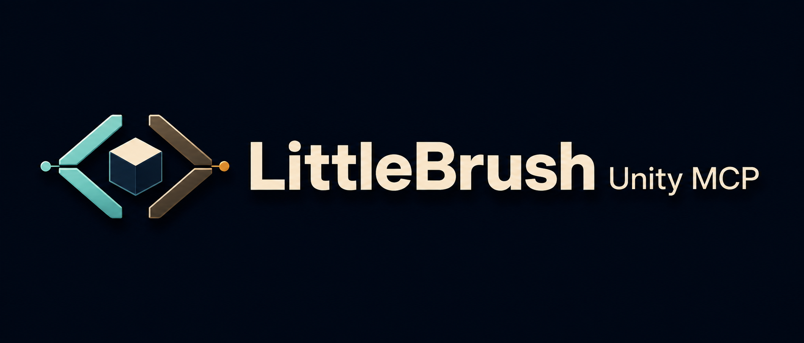
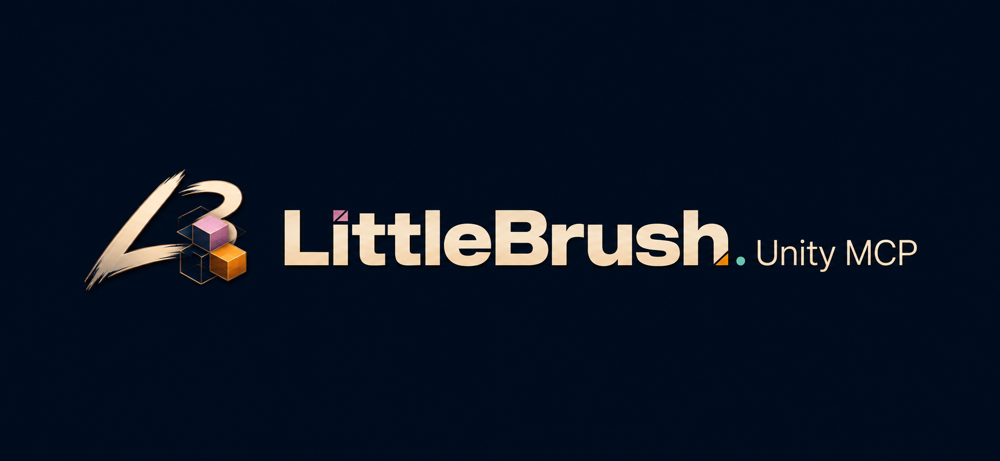

# Logo options

Generated with the supplied brand palette: midnight/navy, cream, amber, mauve, mint, and brass.

## 1 — Brush and cube

The most literal connection between creative tools and 3D authoring. Provisional README choice.

## 2 — Connected editor

A technical connection symbol with mint and brass accents.

## 3 — Creative monogram

A more expressive brushstroke monogram with mauve and amber blocks.
